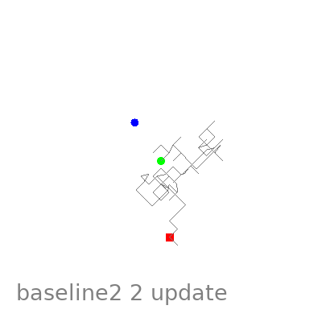

## MAML-RL 2D navigation
 

Source paper
+ Finn, Chelsea, Pieter Abbeel, and Sergey Levine. "Model-agnostic meta-learning for fast adaptation of deep networks." International Conference on Machine Learning. PMLR, 2017.
 
 

Implimented by 
+ Jaekyung Cho, Autonomous Robot Intelligence Lab, Seoul National Univ.  

 

Source codes  
+ 2D navigation environment (modified) : https://github.com/cbfinn/maml_rl/blob/9c8e2ebd741cb0c7b8bf2d040c4caeeb8e06cc95/maml_examples/point_env_randgoal.py  
+ PPO :  
https://github.com/nikhilbarhate99/PPO-PyTorch

 
 

---
### Training Each

> python maml.py --config=/configs/2d-navigation.yaml  
> python baseline1.py --config=/configs/2d-navigation.yaml  
> python baseline2.py --config=/configs/2d-navigation.yaml  
> python baseline3.py --config=/configs/2d-navigation.yaml  

 

### Training All

> python train_all.py --config=/configs/2d-navigation.yaml --maml --bs1 --bs2 --bs3  

result will be saved in **results** directory

 

### Test

> python test_all.py --config=/configs/2d-navigation.yaml

 

---

### Result 

 
we trained three algorithms with tasks which the goal distribution is [-0.5, 0.5] and we evaluate with tasks which the goal distribution is [-1, 1]. We used 100 evaluation tasks and averaging them.
 
 
A blue dot is the goal, and a green dot is initial point(origin).  
A red dot is the moving robot.
  
Only 3 update is enough to solve 2d-navigation task for MAML.
   

  
However baseline1 (pretrained) cannot solve 2d-navigation task. It looks like overfitted to training tasks.
   

  
Baseline2 (random initialized) tend to be adapted to new tasks but much slower than MAML.
  

  
The log-scale reward summation graph is following.  
  

